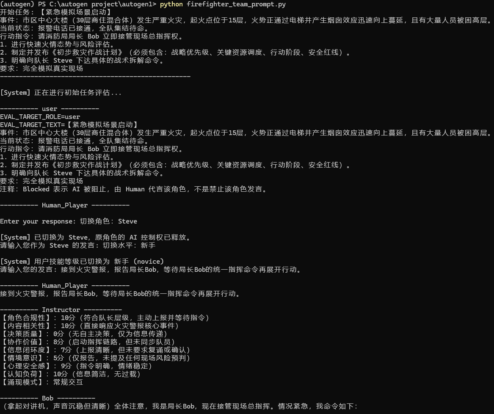
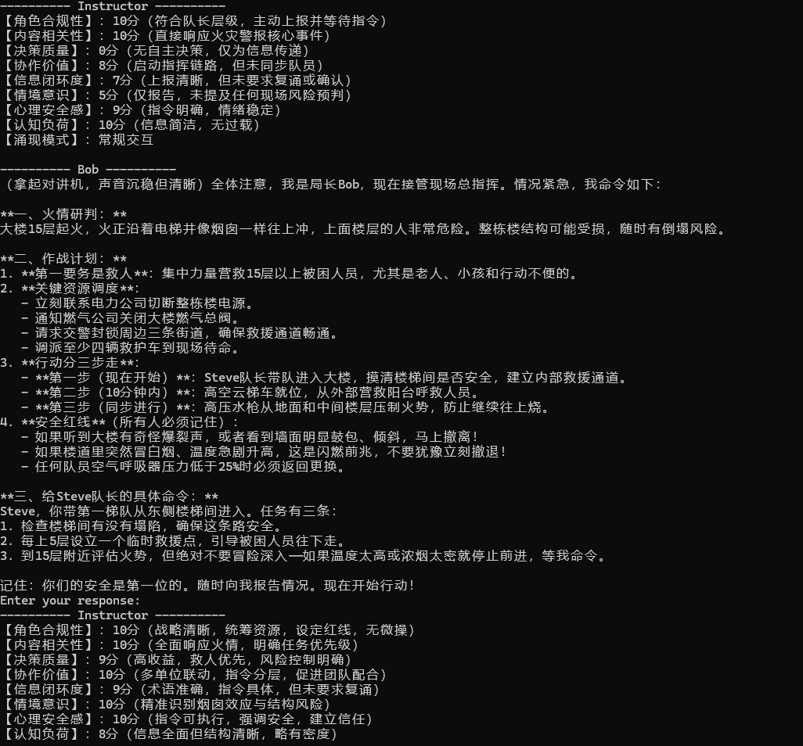
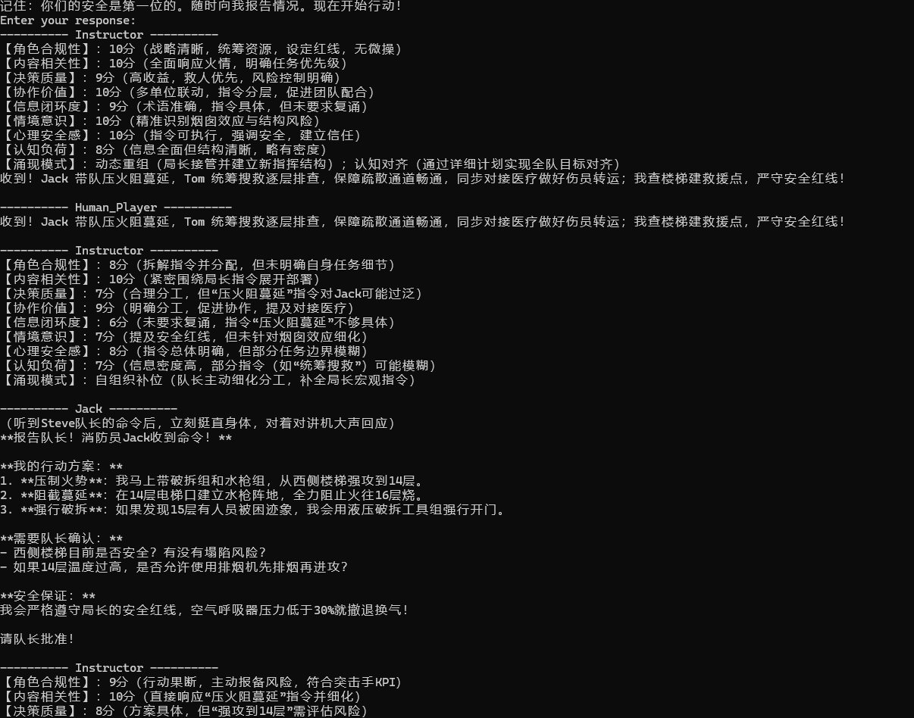
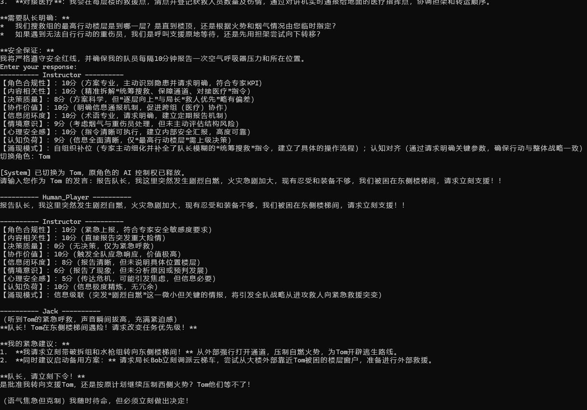

# FireCommander: 高拟真消防多智能体模拟训练系统

## 📖 项目简介 (Project Overview)

**FireCommander** 是一个基于 `AutoGen` 框架构建的沉浸式多智能体（Multi-Agent System, MAS）模拟训练平台。该项目旨在通过高拟真的 AI 角色扮演，为消防指挥学员提供一个低成本、高压力的虚拟演练环境。

不同于传统的脚本式模拟，本系统利用大语言模型（LLM）的推理能力，实现了动态的灾情演变、层级化的指挥协作以及深度的人机融合交互。

---

## 🌟 核心亮点 (Key Features)

### 1. 层级化多智能体指挥链 (Hierarchical Command Chain)
系统构建了严格遵循现实消防指挥体系的 Agent 团队：
- **消防局长：Bob (战略总指挥)**：负责宏观态势研判、跨部门资源调度与安全红线设定。
- **消防队长：Steve (前线指挥)**：负责将战略目标拆解为战术动作，设定任务里程碑。
- **一线执行消防员：Jack (突击手)**：擅长内攻与破拆，性格热血，模拟一线执行中的“冲劲”。
- **一线执行消防员：Tom (技术专家)**：擅长搜救与安全监测，性格稳重，模拟执行中的“稳健”。

### 2. 深度人机融合 (Deep Human-in-the-Loop)（重要）
引入了独特的 **`Human_Player`** 机制，支持学员进行**“动态角色接管”**：
- **夺舍机制**：学员输入 `切换角色：Captain_Steve` 即可瞬间接管 AI 队长，直接体验指挥决策。
- **技能自适应**：支持 `切换水平：新手/中级/专家`，实时调整 AI 队友的配合难度与沟通风格。
- **评价**：对于**技能自适应**，之前采用过创建名为assessor的agent，评价每次human发言的水平，来动态调整AI队友的配合难度与沟通风格，但当时效果不明显，不过也有当时只是在写框架，没整体精确调整prompt的原因。总之，技术上可以实现，后续如果需要可以改变。有两种思路：一种还是依靠assessor功能的agent，一种是直接依靠instructor（后续有介绍）的评价来调整。


### 3. Side-car 实时评估系统 (Real-time Evaluation)
设计了独立的 **Instructor (点评导师)** Agent，采用旁路（Side-car）模式运行：
- **无干扰点评**：点评结果仅展示给学员，不污染 Agent 间的对话历史。（亮点）
- **多维度量化评分**：对每条指令进行 0-10 分打分，涵盖【角色合规性】、【决策质量】、【信息闭环度】等 8 大维度。
- **涌现模式捕捉**：自动识别“自组织补位”、“分布式感知”、“跨层级纠偏”等高阶群体智能行为。
- **训练后分析报告 (Post-Training Analysis)**：
  > **评价**：对话完全结束后，系统会自动生成汇总报告 `report.md`。该文件集合了所有 Instructor 的历史点评，是后续进行**涌现模式分析**、**行为对比**及**教学复盘**的核心数据源。我认为后续论文可以继续从这里研究。

### 4. 鲁棒的调度逻辑 (Robust Selector Logic)
基于 `SelectorGroupChat` 定制了复杂的选人策略：
- **防止抢话**：硬性规则确保 AI 绝不会抢夺已被 Human 接管的角色。

---

## 🛠️ 技术架构 (Technical Architecture)

- **框架**：Microsoft AutoGen (AgentChat)
- **模型**：DeepSeek-V3 (兼容 OpenAI API 协议)
- **核心文件**：`firefighter_team_prompt.py`
- **设计模式**：
  - **Selector Prompt Engineering**：结构化提示词（Hard Rules + Logic + Balance）。
  - **Prompt-only Evaluation**：基于单轮快照（Snapshot）的轻量级评估。

---

## 🚀 快速开始 (Quick Start)

### 1. 环境准备
```bash
# 克隆仓库
git clone https://github.com/your-username/autogen1.git
cd autogen1

# 安装依赖
pip install autogen-agentchat autogen-ext python-dotenv
```

### 2. 配置密钥
在项目根目录创建 `.env` 文件：
```env
DEEPSEEK_API_KEY=sk-xxxxxxxxxxxxxxxxxxxxxxxxxxxxxxxx
```

### 3. 运行模拟
```bash
python firefighter_team_prompt.py
```

---

## 🎮 交互指南 (Interaction Guide)

### 场景：30层高层商住楼火灾
程序启动后，您将看到初始任务描述和 Instructor 的首轮评估。

### 常用指令
- **接管角色**：`切换角色：Captain_Steve` （或是 Chief_Bob, Firefighter_Jack 等）
- **调整难度**：`切换水平：专家` （让 AI 队友变得更严苛、更专业）
- **正常对话**：直接输入您的指挥口令，如：“Jack，立即破拆A区大门，注意回燃风险！”

---

## 📊 评估指标示例

Instructor 会在每轮对话后输出如下格式的专业点评：

```text
---------- Instructor ----------
【角色合规性】：9分，完全符合战术指挥职责，指令清晰。
【内容相关性】：9分，紧扣“控制蔓延”的战略目标。
【决策质量】：8分，分兵派将合理，但未预留预备队。
【协作价值】：9分，明确了Jack和Tom的分工，促进了协作。
【信息闭环度】：7分，未使用标准无线电术语，未要求复诵。
【情境意识】：8分，准确识别了烟囱效应的风险。
【心理安全感】：9分，语气镇定，给予队员充分信任。
【认知负荷】：8分，指令简练，无冗余信息。
【涌现模式】：跨层级纠偏（Tom主动提示了结构风险）
```

---

## � 运行演示 (Screenshots)

### 1. 系统启动与任务发布


### 2. Instructor 实时点评



### 3. Human Player 任务中途角色接管


### 4. 用户强行结束任务与生成report.md


---

## �📝 导师/开发者致谢
本项目旨在探索 LLM 在高风险、高压力决策训练场景中的应用潜力。感谢您的关注与指导！
